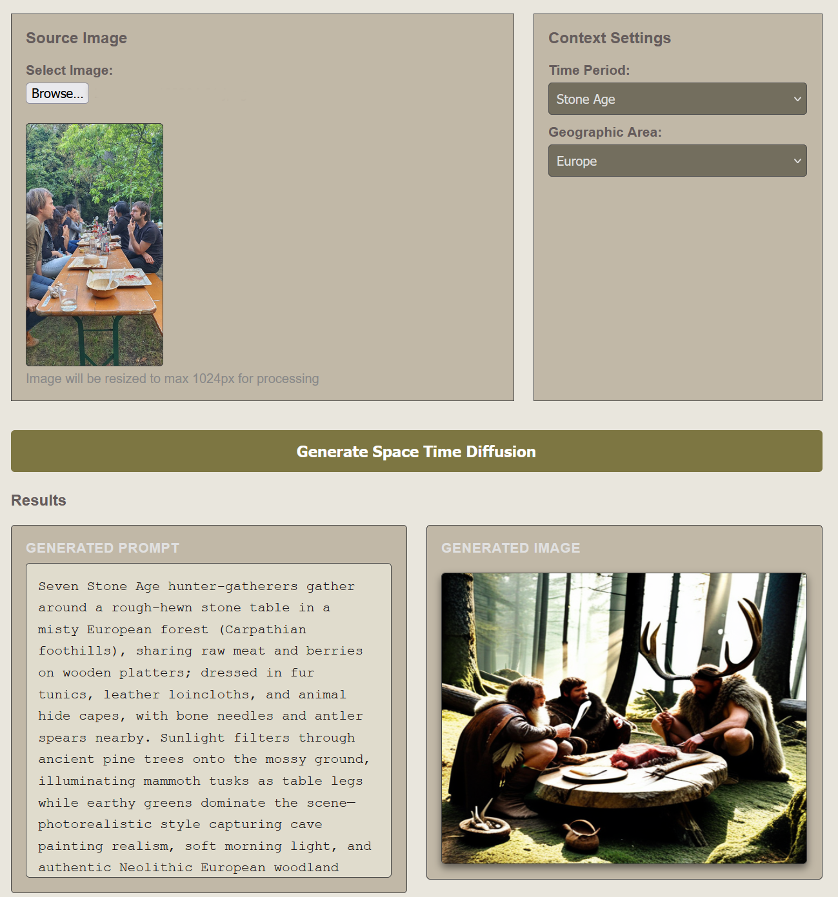
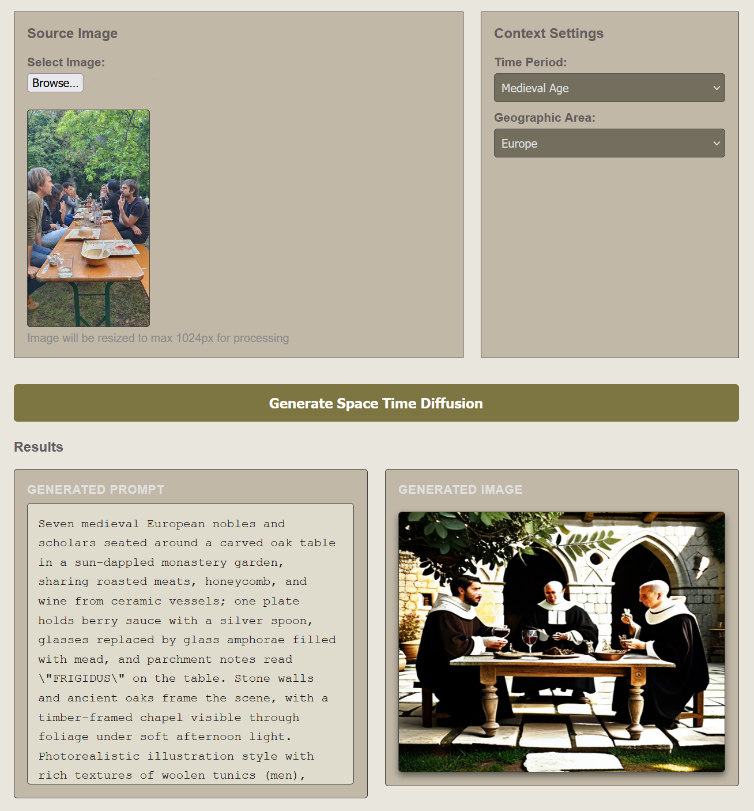
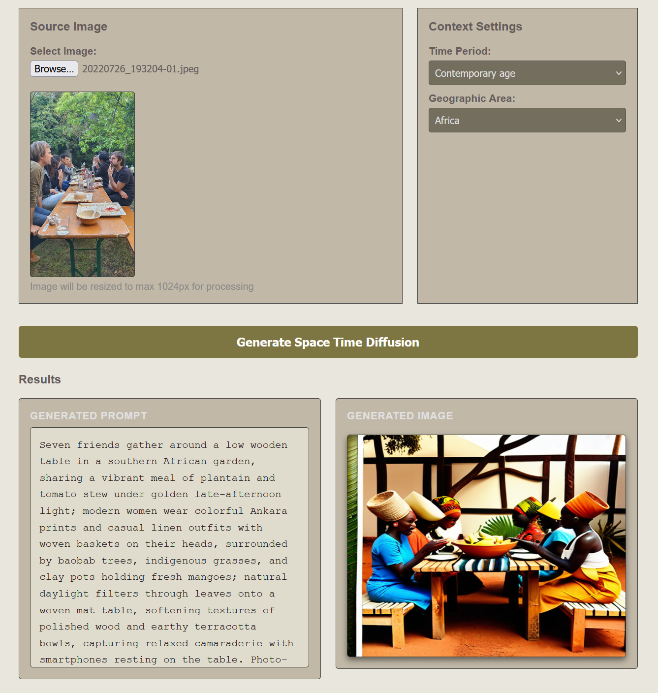
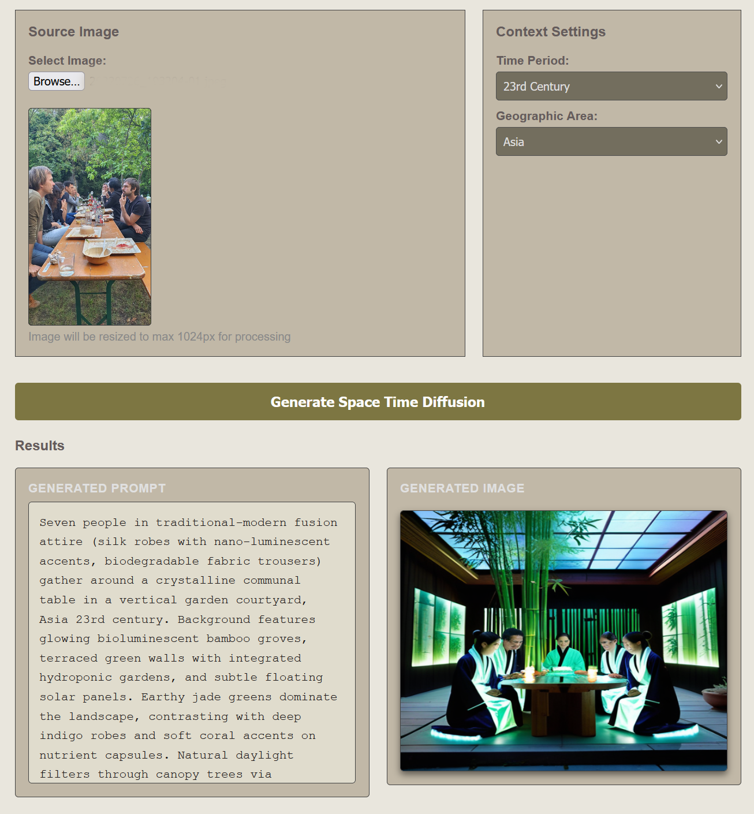

# Space Time Diffusion

**Project description** 
Some of the latest image2image generation models are capable to convert image to different style, replace elements while maintain original image contents consistency with combining VLM(Vision Language Model). 
This proof of concept project is simplified and abstracted version of such latest image2image method. It utilizes VLM functionality to generate image-generation prompts with different contextual framing, **while preserving the content** of the original image.
To orchestrate interactions between the VLM and ComfyUI, n8n is used in this Project.

This workflow has following steps
1. Analyze image with VLM's capability (img2txt)
2. Rewrite the image contents description or image generation prompt which aligns to user chosen time period and geographical area with using LLM's capability(LLM)
3. Generate a new image from the prompt obtained in step 2. Unlike standard image-to-image methods, this process is text-to-image (**txt2img**), not image-to-image.

**Requirement**
- n8n
- OpenAI compatible local LLM endpoint (**note: this workflow does not implement API key support for online LLM services**)
- Vision capable LLM model(VLM, such gemma3, Qwen3-VL). For better context understanding, reasoning model is recommended.
- ComfyUI and Stable Diffusion based model
- A Modern Web browser

**File description**
- index.html: Front-end interface for interacting with the n8n workflow
- space_time_diffusion.json: n8n workflow

**Usage**
1. import n8n workflow on n8n and execute the workflow
2. Open index.html with browser
3. Enter proper URL for each services 
4. Upload image, choose context then click generation button.

**Disclaimer**
Image contents understanding and image generation is heavily rely on capability of Model's capability. 
It may produce strange image generation prompt or images depends on each Models.
This workflow intend to only as proof of concept, not for production use.

**Screenshots**

--

--

--

